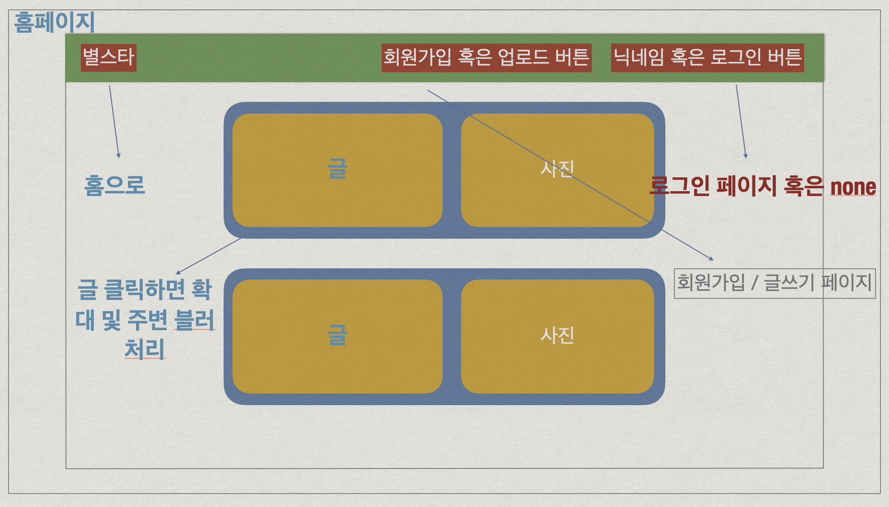
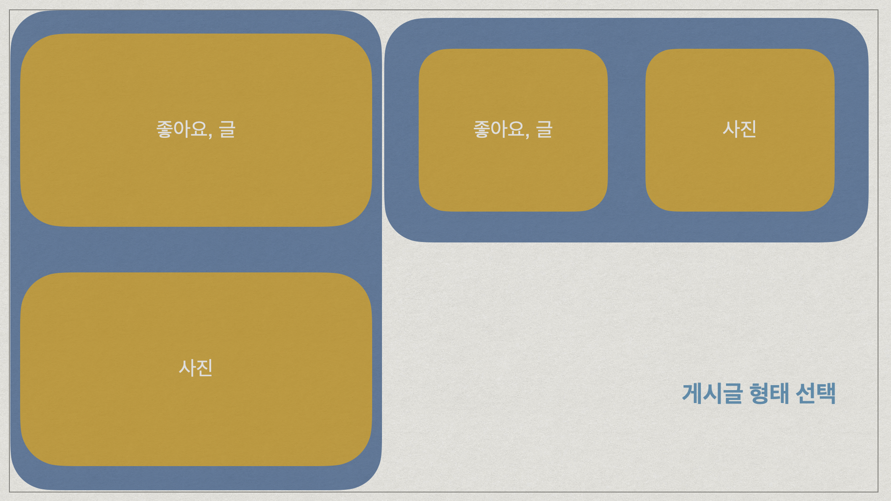

# 별스타(그램)

### 리액트 3주차 과제

## 목표기능

<aside>
✅ 기능 목록
</aside>

게시글

1. [x] 회원가입하기
2. [x] 로그인하기
3. [ ] 목록 가져오기
4. [ ] 추가하기 (+이미지 업로드하기)
5. [ ] 삭제하기
6. [ ] 수정하기
7. [ ] 파이어베이스 or S3로 배포!

<aside>
✅ 페이지별 상세페이지별 상세
</aside>

1. 회원가입 페이지
   1. [x] 이메일 형식 체크, 비밀번호 체크할 것
2. 로그인 페이지
   1. [x] 이메일, 패스워드 미기입 시 로그인 버튼 활성화 막을 것
3. 메인 페이지(게시글 목록 페이지)
   1. [ ] 게시글 목록 노출
   2. [ ] 게시글 하나는 작성자, 작성 시간, 이미지 미리보기, 텍스트 내용으로 구성
   3. [ ] 게시글 하나를 클릭 시, 게시글 상세 페이지로 이동
4. 글 작성 페이지
   1. 레이아웃 선택 버튼
      1. [ ] 3가지 레이아웃 중 선택하도록 한다.
         - 이미지가 오른편에, 텍스트는 왼편에 위치한 레이아웃
         - 이미지가 왼편에, 텍스트는 오른편에 위치한 레이아웃
         - 텍스트가 위에, 이미지는 아래에 위치한 레이아웃
      2. [ ] 레이아웃 선택 시, 게시글 레이아웃(모양새)대로 보이도록 한다.
      3. [ ] **텍스트, 이미지 중 입력 안된 게 있다면 게시글 작성 버튼 비활성화**
      4. [ ] 작성 완료 시 메인 페이지로 이동
5. 게시글 상세 페이지
   1. [ ] 게시글 레이아웃에 맞춰 이미지, 텍스트 위치 조절해서 노출

<aside>
➕ 추가로 해보면 좋을 기능(필수❌)
</aside>

- 메인 페이지 (게시글 목록 페이지)
  1. [ ] 무한 스크롤
  2. [ ] 좋아요 기능 : 게시글 중 좋아요버튼(분홍색 하트 버튼)을 누르면 [좋아요]를 +1한다. 다시 누르면 분홍색 하트가 회색 하트가 되고 좋아요가 -1개 된다.
- [ ] 이미지 여러장 업로드 (상세 페이지에서는 슬라이더로 이미지 넘겨가며 보도록 처리)
- [ ] 알림 기능 만들기 (+알림페이지도 추가할 것!)
- [ ] 좋아요 눌렀을 때 게시글 위로 하트 이미지가 나타났다 사라지게 해보기

## Trouble shooting

- toolkit 사용
  툴킷 내장 thunk(createAsyncThunk)를 쓸 때 Slice의 extraReducers에서 해당 리듀서를 추가 해주어야 한다.
  - 로그인 과정에서 firebase authentication을 통해서 인증을 하는 과정과 firestore userDB에서 유저 정보를 가져와서 유저 리듀서의 state를 초기화 하는 작업을
    하나의 함수 안에서 진행을 했다. 하지만 새로고침 시에 리듀서가 초기화 되기 때문에 그때는 firestore에 접근하는 과정만 필요로 했다. 그래서 firestore에 접근하는 과정을 따로 하나의 파이어베이스 액션 함수로 toolkit 내장 thunk를 써서 만들었다. 새로고침 시 리듀서 초기화 해결!
- 로그인/로그아웃 할 때 마다 헤더의 변화가 빠르게 되지 않음(스피너를 넣어야 하나?.. 일단 업로드 구현하고 생각해보기)
- onChange로 file을 업로딩 함.(강의에서도 그랬음) 그런데 이렇게 하면 업로드 하고 마음에 안들어서 파일을 바꾸면 이미 올라간 건 어떻게 할까?
- userSlice 33번째 줄에서 에러 뜬다.
